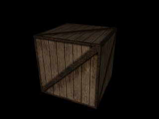



## OpenGL Example Program \(Loading TGA Files\)

### Description

OpenGL in Visual Basic is a largely unexplored area. I did a search on PSC for OpenGL and came up with a mere handful of results. Some of the submissions were quite good, however I felt that they were a little too complex for the beginner in OpenGL. This submission is an altered version of a port to VB from C++ (Original tutorial + VB port available on http://nehe.gamedev.net). This demo initializes OpenGL in fullscreen mode and displays a mipmapped textured cube which you can rotate. The main feature I'm trying to demonstrate here is loading a TGA file from disk and using it as an OpenGL texture. You will need hardware acceleration of some form to view this demo at any form of acceptable frame rate, but I consider this an acceptable requirement.
 
### More Info
 

             |
---                |---
**Submitted On**   |2001-03-01 18:03:54
**By**             |[Dustin Davis](https://github.com/Planet-Source-Code/PSCIndex/blob/master/ByAuthor/dustin-davis.md)
**Level**          |Intermediate
**User Rating**    |4.8 (62 globes from 13 users)
**Compatibility**  |VB 6\.0
**Category**       |[Graphics](https://github.com/Planet-Source-Code/PSCIndex/blob/master/ByCategory/graphics__1-46.md)
**World**          |[Visual Basic](https://github.com/Planet-Source-Code/PSCIndex/blob/master/ByWorld/visual-basic.md)
**Archive File**   |[CODE\_UPLOAD15654312001\.zip](https://github.com/Planet-Source-Code/dustin-davis-opengl-example-program-loading-tga-files__1-21424/archive/master.zip)

